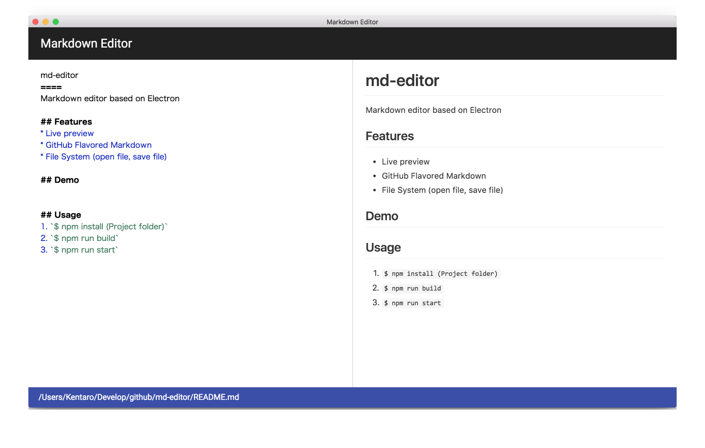

# mdEditor

Electron製のマークダウンエディタ。Electronの勉強のために作成。

## 機能
* リアルタイムプレビュー機能
* mdファイルの読み込みと保存（上書き保存は実装予定）
* GitHub Flavored Markdown

## 起動方法
1. プロジェクトファルダにて`$ npm install`
2. `$ gulp build`でJSをビルド
3. `$ npm start`で起動

## 使用したモジュール
* CodeMirror - JSベースのエディタ
* marked - マークダウン記法をHTMLに変換
* github-markdown-css - Markdownをプレビュー表示する際に適用されるCSS
* office-ui-fabric-react - Officeのデザインを取り入れるReactコンポーネント

## 起動方法（開発）
1. プロジェクトファルダにて`$ npm install`
2. `$ gulp`でJSをビルドし、以降ファイルの編集監視して差分をビルド
3. `$ npm start`で動作確認

## バグ
```
# md-editor
見出し1にハイフンが含まれる場合、HTMLに変換されない
```
